# **ESP32 Meteo Station: Full Stack Project**

## **🌦️ Overview**
The **ESP32 Meteo Station** is an IoT-based weather monitoring system designed to:
- **Collect** real-time **temperature & humidity** data using an **ESP32-based device**.
- **Store** sensor readings in a **Django backend** running on a VPS.
- **Retrieve & display** data through an **Android app** (MIT App Inventor) and an **OLED screen**.
- **Support multiple ESP32 stations**, enabling a **scalable monitoring system**.

Each ESP32 device acts as a **web server**, exposing **JSON API endpoints** (`/lastreport`, `/status`) to provide real-time weather data. A **Flask-based mock server** is available to **simulate ESP32 interactions** for development and testing.

---

## **🛠 System Architecture**
The project consists of:

✅ **ESP32 Weather Stations** (Hardware & firmware, tested with Wokwi)  
✅ **Django Backend** (Cloud-based API & storage using SQLite)  
✅ **Android App** (User-friendly interface for real-time monitoring)  
✅ **Flask Mock Server** (Simulates ESP32 devices for development & testing)  

### **🌍 Data Flow**

```mermaid
graph TD
  subgraph Cloud
    Database["📂 Database (SQLite)"]
    DjangoServer["🌐 Cloud-Based Django Server"]
  end

  subgraph Remote Weather Stations
    RemoteStation1["🌡️ Remote Weather Station 1"]
    RemoteStation2["🌡️ Remote Weather Station 2"]
  end

  subgraph Local Network
    HandyDevice["📱 Device (Handy)"]
    LocalWeatherStation["🌦️ Local Weather Station"]
  end

  %% Data Flow %%
  RemoteStation1 -- "PUT: Upload Data" --> DjangoServer
  RemoteStation2 -- "PUT: Upload Data" --> DjangoServer
  Database -- "Retrieve Data" --> DjangoServer
  LocalWeatherStation -- "PUT: Upload Data" --> DjangoServer
  DjangoServer -- "GET: Config/Commands" --> RemoteStation1
  DjangoServer -- "GET: Config/Commands" --> RemoteStation2
  DjangoServer -- "Save Data" --> Database
  DjangoServer -- "GET: Config/Commands" --> LocalWeatherStation
  HandyDevice -- "GET: Fetch Reports/Data" --> DjangoServer
  HandyDevice -- "GET: Direct Query" --> LocalWeatherStation
```


---

## **📌 Table of Contents**
1. [ESP32 Weather Station](#esp32-weather-station)
2. [Mock Server to Emulate the ESP32 Webserver](#mock-server-to-emulate-the-esp32-webserver)
3. [MIT App Inventor App](#mit-app-inventor-app)
4. [Django VPS Backend](#django-vps-backend)
5. [Interface & Tests](#interface-and-tests)

---

## **🔗 External References**
📌 **ESP32 Hardware Simulation:** [Wokwi Simulator](https://wokwi.com/) _(To be published)_  
📌 **MIT App Development:** [MIT App Inventor](https://appinventor.mit.edu/) _(To be published)_  
📌 **Instructable Guide:** _(To be published)_  

---
 
# **2. ESP32 Weather Station**


 Use Wokwi Locally on VS Code
## **🔹 Install Arduino CLI**
In your **tools directory**, run:
```bash
curl -fsSL https://raw.githubusercontent.com/arduino/arduino-cli/master/install.sh | sh
```
Update **`PATH`** in `.bashrc`:
```bash
export PATH=$PATH:<TOOL-PATH>
```

---

## **🔹 Project Structure**
```
<my-project-path>/esp32-meteo/
├── diagram.json      # Defines ESP32 hardware setup
├── wokwi.toml       # Specifies firmware & ELF paths for Wokwi
├── build/           # Compiled output files (after compilation)
│   ├── esp32-meteo.ino.bin  # Compiled firmware
│   ├── esp32-meteo.ino.elf  # Executable with debugging info
└── esp32-meteo.ino  # Main Arduino code
```
✅ **Copy `diagram.json` & code from Wokwi to your local project.**

---

## **🔹 Install Wokwi on VS Code**
1. Install [Visual Studio Code](https://code.visualstudio.com/).
2. Install the **Wokwi Extension**:
   - Open **Extensions Tab** (`CTRL + SHIFT + X`).
   - Search for **"Wokwi Simulator"** and click **Install**.
3. Activate the Wokwi License:
   ```bash
   CTRL + SHIFT + P → "Wokwi: Request a License"
   CTRL + SHIFT + P → "Wokwi: Manually Enter License Key"
   ```

---

## **🔹 Install ESP32 Core & Required Libraries**
```bash
arduino-cli core update-index
arduino-cli core install esp32:esp32
arduino-cli lib install "Adafruit GFX Library"
arduino-cli lib install "Adafruit SSD1306"
arduino-cli lib install "DHT sensor library"
arduino-cli lib install "ArduinoJson"
arduino-cli lib install "Time"
arduino-cli lib install "NTPClient"
```

✅ **Verify installed libraries:**
```bash
arduino-cli lib list
```

---

## **🔹 Compile & Run ESP32 Wokwi Simulation**
```bash
arduino-cli compile --fqbn esp32:esp32:esp32 --output-dir build esp32-meteo.ino
```
To **run the simulation** in VS Code:
```bash
wokwi-server --project .
```

---

# **3. Mock Server to Emulate the ESP32 Webserver**
During development, you can **emulate the ESP32 Webserver** using a Flask app.

### **🔹 Setup Flask Mock Server**
```bash
mkdir flask_mock_server
cd flask_mock_server

python3 -m venv ~/coding/project/esp32-app-meteo/flask-mock-server/venv
source venv/bin/activate  # Linux/macOS
venv\Scripts\activate    # Windows
pip install -r requirements.txt

# pip install flask requests
# pip freeze > requirements.txt

```
Create the server script:
```bash
touch mok_esp32_meteo_server.py
```
Start the mock server:
```bash
python mok_esp32_meteo_server.py
```
✅ The server will run on:
```
http://0.0.0.0:5000/
```
✅ Test it:
```bash 
curl -X GET http://127.0.0.1:5000/api/status/esp32-001/
curl -X GET http://127.0.0.1:5000/api/lastreport/esp32-001/
curl -X GET http://127.0.0.1:5000/api/history/esp32-001/
curl -X GET http://127.0.0.1:5000/api/minmax/history/esp32-001/
curl -X GET http://127.0.0.1:5000/api/lastupdate/esp32-001/
curl -X GET http://127.0.0.1:5000/api/sync/esp32-001/

```

---


# **4. MIT App Inventor App**
The code of the project is stored in the **`mit-app-inventor`** directory as a **`.aia`** file.

## ** Description**
With **MIT App Inventor**, we create an Android app capable of displaying weather data retrieved from a **web server**.  
The server's **IP is configurable**, and data is retrieved in **JSON format**.

### **🌐 The App Interfaces With:**
✅ **ESP32 Circuit Board** – Emulating a web server in the **local network** (to be implemented).  
✅ **Django Meteo Interface** – Hosted on a **VPS**, serving as the main backend.

---

## **📂 Access the Project Code**
### **🔹 Reopen the Project from the `.aia` File (Stored in GitHub)**
1. Open **[MIT App Inventor](https://appinventor.mit.edu/)**  
2. Go to **Projects > Import project (.aia) from my computer**  
3. Select the **`.aia`** file from your GitHub repository  
4. Continue development 🚀  

### **🔹 Export the MIT App Inventor Project**
1. Open **MIT App Inventor**  
2. Go to **Projects > Export selected project (.aia)**  
3. Save the `.aia` file on your computer  
4. Move the file into the **local GitHub repository**  
5. Commit & push it to GitHub:
   ```sh
   git add mit-app-inventor/MyApp.aia
   git commit -m "Added latest MIT App Inventor project"
   git push origin main
   ```

---
Here's your updated **README** for the Django VPS Backend, including details about the API endpoints, testing, and ensuring smooth integration with ESP32 and the Android app.

---

# **5. Django VPS Backend**
## **🌍 Overview**
The **Django Meteo Backend** is responsible for **storing and serving weather data** collected from multiple ESP32 stations.

### **How It Works**
✅ **ESP32 stations synchronize data** with Django:  
   - The ESP32 **requests the last update timestamp** from Django.  
   - It **sends all new weather data** recorded since the last update.  
   - Django **saves the data** and **updates the last timestamp** for the ESP32 station.

✅ **Django serves weather data** to external applications:  
   - The **Android app fetches the list of stations** from Django.  
   - The app **retrieves weather data for a specific station** based on a time range.  
   - Data is formatted in **JSON** for easy integration.

---

## **Installation & Setup**
### **1️⃣ Clone the Django Meteo Code from GitHub**
```sh
git clone https://github.com/YOUR_GITHUB_USERNAME/esp32-app-meteo.git
cd esp32-app-meteo/django-meteo
```
 
### **2️⃣ Run the Setup Script**
```sh
chmod +x ./scripts/setup_production.sh
./scripts/setup_production.sh
```
🚀 **This script will:**
- ✅ **Create a virtual environment** (if it doesn't exist).
- ✅ **Activate the virtual environment**.
- ✅ **Install dependencies** (`pip install -r requirements.txt`).
- ✅ **Run database migrations** (`python manage.py migrate`).
- ✅ **Populate the database with fake ESP32 data** (`python scripts/populate_fake_data.py`).

---

### **3️⃣ Verify Installation**
Run the test script:
```sh
./scripts/test_installation.sh
```
✅ **This script checks:**
- That **Python and the virtual environment** are properly set up.
- That **database migrations** were applied correctly.
- That **fake ESP32 data** was inserted successfully.

---

### **4️⃣ Start the Django Server for development**
Run the Django development server:
```sh
cd esp32-app-meteo/django-meteo
source venv/bin/activate
python manage.py runserver
```
✅ **This will:**
- Start the server at `http://127.0.0.1:8000/`
- Allow local testing of API endpoints.

The end point should be :
curl -X GET http://127.0.0.1:8000/api/stations/
curl -X GET http://127.0.0.1:8000/api/status/esp32-test-001/
curl -X GET http://127.0.0.1:8000/api/lastreport/esp32-test-001/
curl -X GET http://127.0.0.1:8000/api/history/esp32-test-001/
curl -X GET http://127.0.0.1:8000/api/minmax/history/esp32-test-001/
curl -X GET http://127.0.0.1:8000/api/lastupdate/esp32-test-001/
curl -X GET http://127.0.0.1:8000/api/sync/esp32-test-001/


### **5 Deployment on production with jenkins and github** 
 !!!!!!!!!!!To be done  


### **6 Start the Django Server for production** 
 !!!!!!!!!!!To be done  
---


## **📂 Project Structure**
```
django-meteo/
│── api/         (Django app)
│   ├── migrations/    (Database migration files)
│   ├── models.py      (Database schema)
│   ├── tests.py       (Unit tests)
│   ├── views.py       (API logic)
│── meteo/       (Django project, contains settings.py)
│   ├── settings.py    (Django configuration)
│   ├── urls.py        (API endpoints)
│── manage.py    (Django project entry point)
│── venv/        (Python virtual environment)
│── scripts/     (Custom project management tools)
│   ├── setup_production.sh   (Initial setup script)
│   ├── test_installation.sh  (Checks if installation was successful)
│   ├── populate_fake_data.py (Generates test ESP32 data)
```

# **Interface and Tests**
 

## 📌 Documentation
- 📖 [API Interface Definition](documentation/interface.md) – Details about API endpoints and JSON structures.
- 🛠️ [Testing Instructions](documentation/test.md) – Steps to verify Django server functionality.

---
