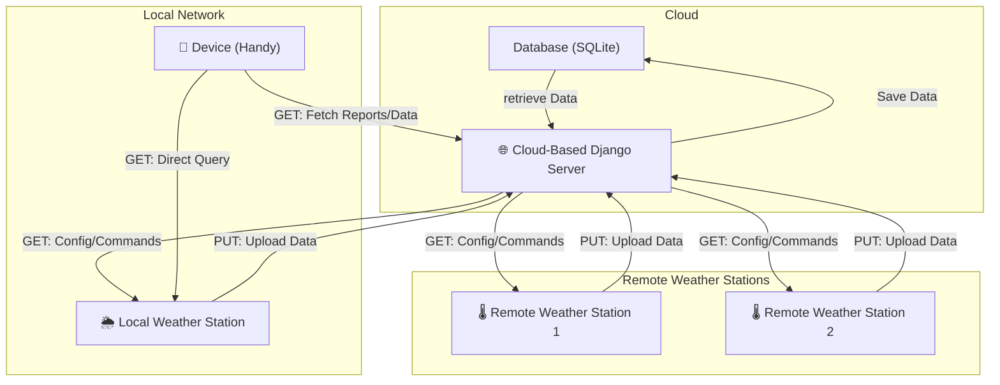

```mermaid
graph TD
  subgraph Cloud
    Database["Database (SQLite)"]
    DjangoServer["🌐 Cloud-Based Django Server"]
  end

  subgraph Remote Weather Stations
    RemoteStation1["🌡️ Remote Weather Station 1"]
    RemoteStation2["🌡️ Remote Weather Station 2"]
  end

  subgraph Local Network
    HandyDevice["📱 Device (Handy)"]
    LocalWeatherStation["🌦️ Local Weather Station"]
  end

  %% Data Flow %%
  RemoteStation1 -- "PUT: Upload Data" --> DjangoServer
  RemoteStation2 -- "PUT: Upload Data" --> DjangoServer
  Database -- "retrieve Data" --> DjangoServer
  LocalWeatherStation -- "PUT: Upload Data" --> DjangoServer
  DjangoServer -- "GET: Config/Commands" --> RemoteStation1
  DjangoServer -- "GET: Config/Commands" --> RemoteStation2
  DjangoServer -- "Save Data" --> Database
  DjangoServer -- "GET: Config/Commands" --> LocalWeatherStation
  HandyDevice -- "GET: Fetch Reports/Data" --> DjangoServer
  HandyDevice -- "GET: Direct Query" --> LocalWeatherStation
```